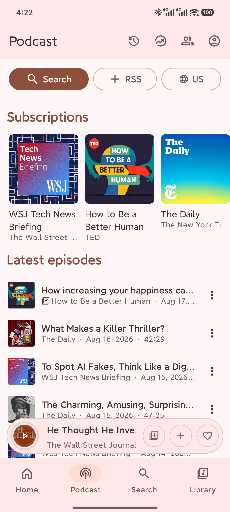
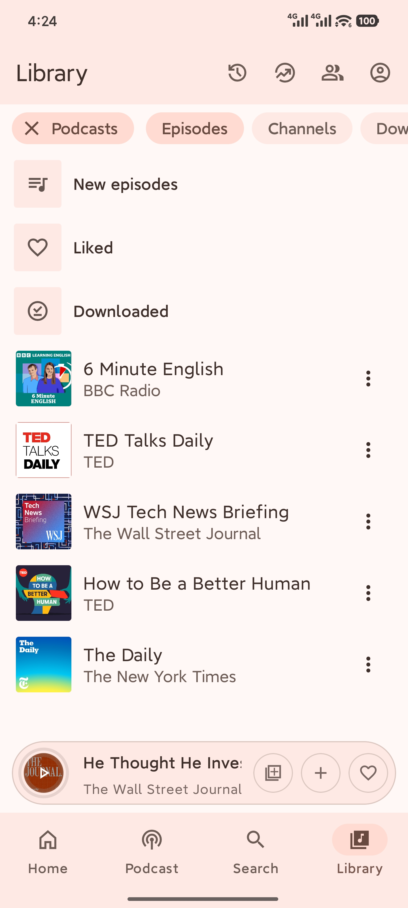
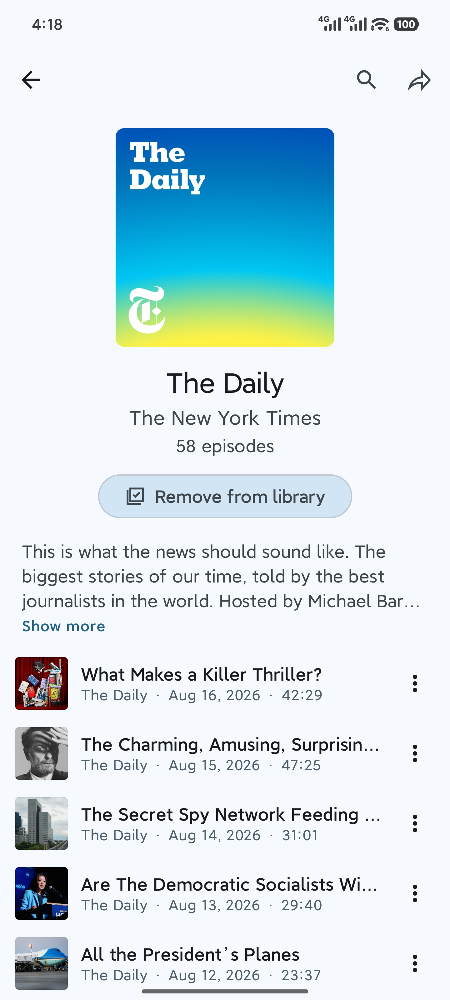
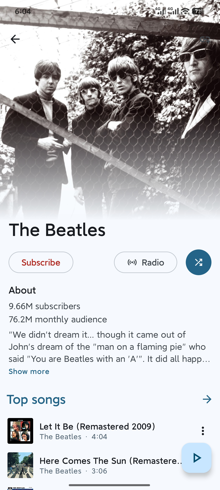
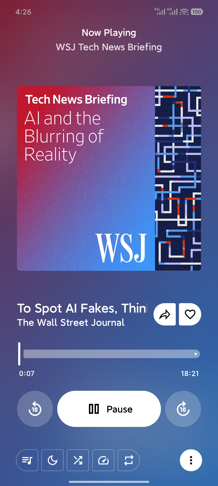

<p align="right">
  <a href="#english">English</a> · <a href="#简体中文">简体中文</a>
</p>

<p align="center">
  
</p>

<h1 align="center">MetroVerse</h1>

<p align="center">
  A powerful modified version of <a href="https://github.com/MetrolistGroup/Metrolist">Metrolist</a>.<br>
  Youtube Music and open podcasts, one Android listening experience.
</p>

<p align="center">
  <a href="https://github.com/RizkLee/MetroVerse/releases"></a>
  
  <a href="LICENSE"></a>
</p>

<p align="center">
  <b>
    <a href="#releases-and-verification">Download</a> · <a href="#下载与校验">下载</a>
  </b>
</p>

## Screenshots

<table>
  <tr>
    <td width="180"></td>
    <td width="180"></td>
    <td width="180"></td>
    <td width="180"></td>
    <td width="180"></td>
  </tr>
  <tr>
    <td align="center">Podcast</td>
    <td align="center">Library</td>
    <td align="center">Show details</td>
    <td align="center">Artist details</td>
    <td align="center">Now playing</td>
  </tr>
</table>

<a id="english"></a>

## English

MetroVerse is an independently maintained, modified version of the [Metrolist](https://github.com/MetrolistGroup/Metrolist) Android client. It integrates the full YouTube Music and Open RSS podcasts, delivering a fresh, comfortable, and elegant experience.

It keeps the familiar Material 3 Expressive interaction model inherited from Metrolist while adding native podcast discovery, subscriptions, direct media playback, resume state, and podcast-aware controls. Furthermore, some operational logic from the original Metrolist application has been modified for greater ease of use. Apple Podcasts is used to discover public feeds and no Apple account is required.

### Highlights

- 🎨 **Expressive UI:** Stunning Material Design 3 Expressive interface with Dynamic Color support, beautifully adapted for phones, tablets, and landscape modes.
- 🔓 **Unrestricted & Ad-Free:** Say goodbye to annoying ads and playback restrictions. Enjoy seamless background playback and download your favorite songs for offline listening.
- 🎵 **All-in-one Audio:** Seamlessly unifies YouTube Music and your open RSS podcasts into one elegant app, while keeping their libraries perfectly separated.
- 🎙️ **Powerful Podcast Engine:** Discover shows via Apple Podcasts charts or direct RSS/Atom import. Features episode resume, playback speed controls, and a gradual sleep-timer fade.
- 🪶 **Modern & Lightweight:** Built on the robust Media3 player. Fast, responsive, battery-friendly, and fully supports Android Auto.

### Project lineage

MetroVerse is built from established GPL-3.0 work:

- [Metrolist](https://github.com/MetrolistGroup/Metrolist) provides the music architecture, Jetpack Compose foundation, player, queue, downloads, database, and most inherited functionality.
- [Podium](https://github.com/aimok04/podium) was studied as a GPL-3.0 reference for Apple Podcasts discovery, RSS parsing, subscriptions, and genre-based podcast browsing.
- MetroVerse integrates those podcast concepts into Metrolist's existing architecture. It does not embed Podium directly.

MetroVerse is not an official release of Metrolist or Podium and is not affiliated with Apple, Google, or YouTube. Original copyright notices, source headers, and contribution history remain preserved. See [NOTICE.md](NOTICE.md) and [LICENSE](LICENSE).

### Package

```text
App name:        MetroVerse
Application ID:  com.rizklee.metroverse
Debug ID:        com.rizklee.metroverse.debug
Version:         0.5.3
Minimum Android: Android 8.0 / API 26
Target Android:  API 36
```

The inherited Kotlin namespace remains `com.metrolist.music`; the installed application uses the independent MetroVerse package ID above.

### Build

Requirements:

- Android Studio or command-line Gradle with JDK 21.
- Android SDK Platform 37 and Platform Tools.

```powershell
# Debug APK
.\gradlew.bat :app:assembleFossDebug

# Podcast-focused tests
.\gradlew.bat :app:testFossDebugUnitTest --tests "com.metrolist.music.podcast.PodcastParsingTest"

# Signed release, requires the private local signing configuration
.\gradlew.bat :app:assembleFossRelease
```

Release signing uses a private keystore that must never be committed. GitHub Actions signing uses repository Secrets and the same long-term certificate so installed releases remain upgrade-compatible.

### Releases and verification

Downloads are published on the [Releases page](https://github.com/RizkLee/MetroVerse/releases). You may verify the attached SHA-256 file and APK signing certificate before installation.

| Variant  | Description                                | Download link                                                                                        |
| -------- | ------------------------------------------ | ---------------------------------------------------------------------------------------------------- |
| FOSS APK | MetroVerse app without Google Cast support | [Download](https://github.com/RizkLee/MetroVerse/releases/download/v0.5.3/MetroVerse-v0.5.3-foss.apk) |
| GMS APK  | The same app, but with Google Cast support | [Download](https://github.com/RizkLee/MetroVerse/releases/download/v0.5.3/MetroVerse-v0.5.3-gms.apk)  |

### Pending Issues

- Podcast refresh is foreground-driven; periodic WorkManager refresh is not included yet.
- OPML, private-feed authentication, chapters, and transcripts are not included yet.
- DRM, login-protected, expiring, or unsupported media URLs may fail.

### Contributing

Issues and focused pull requests are welcome. Do not include account cookies, private feed URLs, API credentials, signing material, or personal listening data in reports.

MetroVerse remains a standalone learning project, and the project may not provide very timely maintenance.

### License

MetroVerse is distributed under the [GNU General Public License v3.0](LICENSE). Distributors of modified APKs must preserve attribution and satisfy GPL source-availability requirements.

### Disclaimer

Please ensure you comply with the terms of any services and podcast feeds you access. MetroVerse makes no guarantees regarding service availability, data keeping, continued compatibility, or account security. Use at your own risk.

---

<a id="简体中文"></a>

<p align="right"><a href="#english">Back to English</a></p>

## 简体中文

MetroVerse 是一个独立维护的修改版 [Metrolist](https://github.com/MetrolistGroup/Metrolist) Android 音频客户端，整合了完整的 YouTube Music 与 Open RSS 播客，带来了全新、舒适、优雅的体验。

应用延续了 Metrolist 熟悉的 Material 3 Expressive 交互方式，并原生加入播客发现、订阅、直链播放、断点续播和播客专用控制。此外，修改了原 Metrolist 应用部分操作逻辑，使之更加顺手好用。使用 Apple Podcasts 发现公开订阅源，不需要 Apple 账号。

### 亮点

- 🎨 **极佳颜值：** 采用 Material Design 3 Expressive 风格并全面支持动态配色，完美适配手机、平板及横屏布局。
- 🔓 **纯净体验：** 彻底告别烦人的广告！解除各种播放限制，支持后台播放，并提供音乐与播客下载功能。
- 🎵 **聚合播放：** 无缝融合 YouTube Music 与开源 RSS 播客。两者逻辑清晰独立，播客内容绝不会误入你的 YouTube 电台或 Last.fm 记录。
- 🎙️ **强大播客引擎：** 内置 Apple Podcasts 榜单发现与 RSS/Atom 直连订阅，支持断点续播、倍速控制与睡眠渐弱暂停。
- 🪶 **极致轻量：** 基于先进的 Media3 播放器打造，响应迅速、流畅省电，且原生支持 Android Auto。

### 项目来源

MetroVerse 建立在两个 GPL-3.0 项目的工作之上：

- [Metrolist](https://github.com/MetrolistGroup/Metrolist) 提供音乐架构、Jetpack Compose 界面基础、播放器、队列、下载、数据库及大部分继承功能。
- [Podium](https://github.com/aimok04/podium) 是 Apple Podcasts 发现、RSS 解析、订阅和播客分类浏览的 GPL-3.0 参考实现。
- MetroVerse 将这些播客思路整合进 Metrolist 的既有架构，但并未直接嵌入 Podium。

MetroVerse 不是 Metrolist 或 Podium 的官方版本，与 Apple、Google 或 YouTube 没有隶属关系。原项目版权、源码头和贡献历史均保留，详见 [NOTICE.md](NOTICE.md) 与 [LICENSE](LICENSE)。

### 包信息

```text
应用名称：      MetroVerse
正式包名：      com.rizklee.metroverse
调试包名：      com.rizklee.metroverse.debug
当前版本：      0.5.3
最低系统：      Android 8.0 / API 26
目标 API：      36
```

内部 Kotlin namespace 继续使用 `com.metrolist.music` 以保持继承代码兼容；安装到设备上的应用使用独立 MetroVerse 包名。

### 构建

环境要求：JDK 21、Android SDK Platform 37 和 Platform Tools。

```powershell
# 调试 APK
.\gradlew.bat :app:assembleFossDebug

# 播客专项测试
.\gradlew.bat :app:testFossDebugUnitTest --tests "com.metrolist.music.podcast.PodcastParsingTest"

# 签名正式版，需要本机私有签名配置
.\gradlew.bat :app:assembleFossRelease
```

正式签名 keystore 不得提交到仓库。GitHub Actions 必须使用同一张长期证书进行签名，才能让已安装的正式版继续覆盖升级。

### 下载与校验

APK 发布在 [Releases 页面](https://github.com/RizkLee/MetroVerse/releases)。安装前可核对随附 SHA-256 文件和 APK 签名证书。

| App 版本 | 适用场景                            | 下载链接                                                                                                    |
| -------- | ----------------------------------- | ----------------------------------------------------------------------------------------------------------- |
| FOSS APK | 音乐与播客，不包含 Google Cast 功能 | [下载 MetroVerse](https://github.com/RizkLee/MetroVerse/releases/download/v0.5.3/MetroVerse-v0.5.3-foss.apk) |
| GMS APK  | 音乐与播客，包含 Google Cast 功能   | [下载 MetroVerse](https://github.com/RizkLee/MetroVerse/releases/download/v0.5.3/MetroVerse-v0.5.3-gms.apk)  |

### 待解决

- 播客刷新目前由前台页面和手动下拉触发，尚未加入 WorkManager 周期刷新。
- 尚未加入 OPML、私人订阅认证、章节和转录文本。
- DRM、登录保护、过期或设备不支持的媒体地址可能无法播放。

### 参与开发

欢迎提交清晰、范围明确的 Issue 和 Pull Request。请勿在报告中附带账号 Cookie、私人订阅地址、API 凭据、签名材料或个人收听数据。

MetroVerse 仍带有独立学习性质，项目可能不会提供非常及时的维护。

### 许可证

MetroVerse 使用 [GNU GPL v3.0](LICENSE)。分发修改后的 APK 时，必须保留来源归属，并履行 GPL 对应源码提供义务。

### 免责声明

使用者应自行遵守所访问服务和播客订阅源的条款。MetroVerse 不提供任何担保，也不保证服务可用性、数据保存、持续兼容性或账号安全。

---

<p align="center">
  <a href="https://buymeacoffee.com/rizklee">
    
  </a>
</p>
